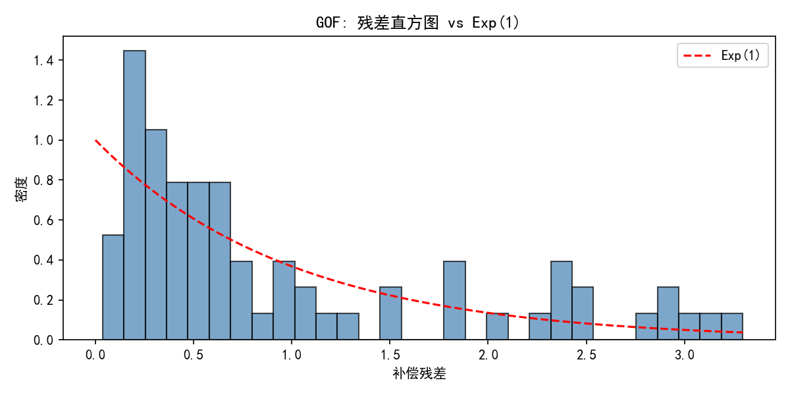

# 应用 Hawkes 过程对于订单流建模：毒性识别与价格冲击预测

本项目实现了基于指数核的多维 Hawkes 过程，用于高频订单流建模；提供泊松过程基线、Ogata 薄化仿真、最大似然估计（MLE）、可视化与模型比较，并给出“毒性”市价单识别与短期价格冲击的简易度量。

## 安装

```bash
pip install -r requirements.txt
```

## 目录结构

- `workflow/`：按环节组织的代码包
  - `models/`
    - `hawkes.py`：多维 Hawkes（指数核），仿真/似然/残差/强度
    - `legacy.py`：简化版单变量 Hawkes（入门/对照）
  - `fit/`
    - `mle.py`：投影梯度 MLE（非负约束、min_beta、谱半径投影 rho_max、可选 L2）
    - `map_em.py`：MAP-EM（Gamma 先验，支持 min_beta，默认不更新 beta）
  - `baselines/`
    - `poisson.py`：均匀泊松过程与率 MLE
  - `eval/`
    - `compare.py`：Hawkes vs Poisson 的 AIC/似然
  - `viz/`
    - `plots.py`：事件栅格、强度曲线、残差直方图
    - `graph.py`：稀疏传染图（Alpha 热力图，支持阈值显示）
  - `gof/`
    - `tests.py`：KS(Exp/Uniform)、Ljung–Box/ACF、Uniform 变换
    - `plots.py`：QQ-plot 与直方图
  - `preprocess/`
    - `jitter.py`：时间戳抖动（1e-6，消除同刻堆叠）
    - `seasonal.py`：分段常数基线初值估计（吸收盘中季节性）
  - `io/`
    - `events.py`：事件 JSON 读写
  - `tuning/`
    - `runner.py`：多随机种子的仿真-拟合-比较-谱半径
    - `grid.py`：min_beta / l2_alpha / rho_max 的网格搜索（AIC+残差指标）
  - `analytics/`
    - `toxicity.py`：市价单“毒性”评分与短期价格冲击代理
  - `tick_integration/`
    - `adapter.py`：tick.hawkes 的拟合接口（自动回退与清洗）
- `main.py`：命令行入口（仿真/拟合/保存加载）

## 快速开始

仿真（保存JSON与图片，不弹窗）：

```bash
python main.py simulate --dim 1 --T 30 --mu 0.6 --alpha 0.7 --beta 1.2 --plot --no_show --min_events 60 --max_retries 80 --out events.json
```

MLE 或 MAP-EM 拟合，并与泊松基线比较：

```bash
# 稳定化 MLE
python main.py fit --dim 1 --T 30 --input events.json --plot --no_show \
  --method mle --max_iter 3000 --step_mu 5e-3 --step_alpha 5e-3 --step_beta 1e-4 \
  --min_beta 0.4 --rho_max 0.85

# MAP-EM（带先验）
python main.py fit --dim 1 --T 30 --input events.json --plot --no_show \
  --method map_em --max_iter 500 --min_beta 0.4 \
  --prior_mu_a 1.0 --prior_mu_b 1.0 --prior_alpha_a 1.0 --prior_alpha_b 1.0 \
  --prior_beta_a 2.0 --prior_beta_b 2.0
```

## 调参与稳定性（tuning）

使用 `workflow/tuning/runner.py` 在多个随机种子下重复“仿真-拟合-比较”，并输出谱半径（`alpha/beta` 的谱半径<1 表示稳定）：

```python
from workflow.tuning import simulate_and_tune
report = simulate_and_tune(dim=1, T=30.0, seeds=(1,2,3), mu=0.6, alpha=0.7, beta=1.2)
print(report)

## 拟合优度（三件套）

- KS 对 Exp(1)、KS 对 Uniform（对 U=1-exp(-ΔΛ)）与 Ljung–Box/ACF 自相关检验
- p 值 >= 0.05 视为“不过度拒绝”（可用 0.01 为强标准）
- 输出：样本量 n、KS_Exp D/p、KS_Uni D/p、LB Q/p；并保存 QQ-plot 与直方图

```bash
python main.py gof --dim 1 --T 30 --input events.json --method mle --jitter --seasonal_bins 10
```

说明：
- --jitter 会对秒/毫秒时间戳加 1e-6 抖动，消除同刻堆叠；
- --seasonal_bins>0 会用分段常数估计基线初值，吸收盘中季节性（U 型/收盘拥堵）。

## 初次实验结果（单维示例，T=30，n≈70）

- 参数估计（MLE，稳定化）：
  - mu ≈ 0.7402，alpha ≈ 0.8616，beta ≈ 1.2366，分枝比 G ≈ 0.70 < 1（稳定）
  - 对数似然 loglik ≈ 7.2776
  - AIC（Hawkes）≈ -8.5553，对比 Poisson AIC ≈ 23.3783（显著更优）
- 三件套 GOF（残差补偿检验）：
  - KS-Exp: D ≈ 0.0913，p ≈ 0.5721（不过度拒绝）
  - KS-Uniform: D ≈ 0.0913，p ≈ 0.5721（不过度拒绝）
  - Ljung–Box(20): Q ≈ 16.124，p ≈ 0.7089（无显著自相关）
- 结论：
  - 模型在该数据上拟合良好，较泊松基线有显著性能提升，残差分布与独立性检验均通过。

### 可视化（示例输出）

下图由以下命令自动生成（文件位于项目根目录）：

```bash
# 拟合与可视化
python .\main.py fit --dim 1 --T 30 --input .\events.json --plot --no_show \
  --method mle --max_iter 3000 --step_mu 5e-3 --step_alpha 5e-3 --step_beta 1e-4 \
  --min_beta 0.4 --rho_max 0.85 --adj_threshold 0.0

# 拟合优度检验
python .\main.py gof --dim 1 --T 30 --input .\events.json --method mle \
  --jitter --seasonal_bins 10
```

#### 事件栅格与强度轨迹


#### 残差分析


#### 拟合优度检验



## 毒性识别与价格冲击（暂定）

`analytics.py` 提供：
- 毒性分数：短期窗口内由该笔市价单引发的期望“子事件”增量的近似值；
- 冲击代理：价格冲击可取毒性分数的线性函数（系数可用实证估计）。

## 进阶：结合 tick 包与本地 MHP 类

- 可选方案：使用 `tick` 包（`tick.hawkes`）进行参数估计/仿真，以对比本实现（需 `pip install tick`）。
- 也可沿用本仓库 `MHP`/`HawkesExponential`，前者适合入门演示，后者支持多维与评估工具链。

## 方法说明

- **过程与核**：指数核 Hawkes 过程，强度函数为：
  ```
  λᵢ(t) = μᵢ + Σⱼ Σₖ αᵢⱼ e^(-βᵢⱼ(t-tₖʲ))
  ```
  其中 μᵢ 为基线强度，αᵢⱼ 为激励强度，βᵢⱼ 为衰减参数。

- **仿真**：Ogata 薄化算法（自适应上界），时间复杂度接近 O(n)。

- **似然计算**：指数核的闭式对数似然与积分项，避免 O(n²) 逐对累加带来的数值下溢。

- **稳定性约束**：
  - 硬约束：β ≥ min_beta、谱半径投影 ρ(α/β) ≤ rho_max
  - 可选软约束：对 α 加 L2 正则化抑制过大分枝比（提升可解释性）

- **参数估计**：
  - **MLE**：投影梯度上升（步长可调、支持小步长+高迭代），对多维/多日可并行
  - **MAP-EM**：Gamma 先验（μ, α, β），E 步计算父子责任、M 步闭式更新（默认固定 β）

- **残差与拟合优度**：时间重标定残差 ΔΛ，进行 KS(Exp/Uniform) 与 Ljung–Box 检验；QQ/直方图核对 Exp(1) 分布。
- **季节性处理**：分段常数基线初值（`--seasonal_bins`）与时间戳抖动（`--jitter`）吸收盘中 U 型等模式。

- **稀疏传染图**：`--adj_threshold` 直观展示谁激励谁，结合 tick 的 L1 正则化可做对照。

## 扩展方向

- **稳定性保证**：`alpha/beta` 的谱半径 < 1 确保过程稳定
- **多维建模**：维度可映射买/卖/不同事件类型，支持跨类型激励分析
- **核函数扩展**：可替换为双指数、幂律等核函数，避免将长记忆误判为短记忆
- **外生因子**：加入价格过程、成交量等外生变量进行联立建模

## 备注

- 稳定性：`alpha/beta` 的谱半径<1；
- 多维：维度可映射买/卖/不同事件类型；
- 可扩展：替换核函数、加入外生因子或价格过程联立建模。
- 扩展基线建模：当前模型的基线强度（μ）是常数，可尝试使用时间依赖基线（例如：分段常数基线、线性基线或样条基线）来考虑不同时间段内市场的不同交易节奏。
- 互激励建模：目前模型使用的是**单变量 Hawkes 过程**，适用于单一事件序列。如果希望捕捉不同事件（例如买单、卖单、价跃升等）之间的互激励效应，可以扩展为 **多变量 Hawkes 过程**。在多维 Hawkes 模型中，每个维度之间的激励（αij）参数可以帮助了解一个事件如何通过其激励其他类型的事件。
